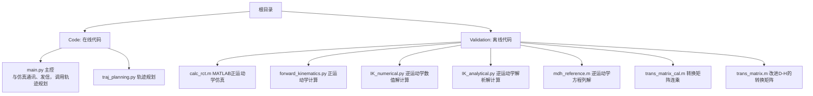

# 文件层级说明v1 2025.6.27

```mermaid
graph TD
    A[根目录]
    A --> B[Code: 在线代码]
    B --> B1[main.py 主控<br/>与仿真通讯、发信，调用轨迹规划]
    B --> B2[traj_planning.py 轨迹规划]
    A --> C[Validation: 离线代码]
    C --> C1[calc_rct.m MATLAB正运动学仿真]
    C --> C2[forward_kinematics.py 正运动学计算]
    C --> C3[IK_numerical.py 逆运动学数值解计算]
    C --> C4[IK_analytical.py 逆运动学解析解计算]
    C --> C5[mdh_reference.m 逆运动学方程列解]
    C --> C6[trans_matrix_cal.m 转换矩阵连乘]
    C --> C7[trans_matrix.m 改进D-H的转换矩阵]
```